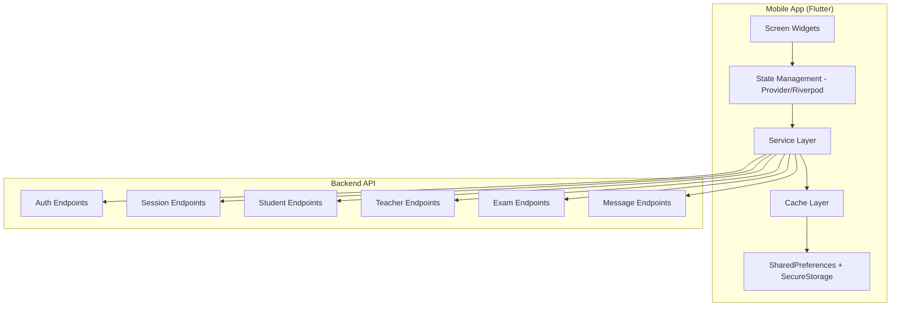
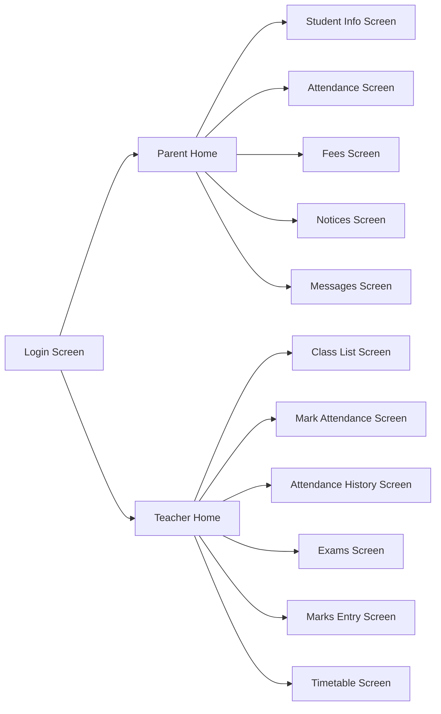

# Design Document: Mobile Parent-Teacher Enhancement

## Overview

This design extends the existing mobile app to provide comprehensive parent and teacher functionality, achieving feature parity with the web application for these roles. The mobile app is built with Flutter, connecting to an existing Node.js/Express REST API.

### Current State

The mobile app has:
- Basic authentication flow for admin, teacher, and parent roles
- Read-only parent portal with student info, attendance, fees, and notices
- Minimal teacher functionality
- Secure token-based authentication with flutter_secure_storage
- Basic API integration patterns

### Design Goals

1. Enable parents to view and update contact information
2. Enable parents to send messages to school administration
3. Enable teachers to mark attendance for their classes
4. Enable teachers to enter and manage exam marks
5. Enable teachers to create and manage exams
6. Implement offline caching for read operations
7. Provide clear error handling and user feedback
8. Maintain consistent UI/UX patterns across roles
9. Create a beautiful, modern, polished UI using Flutter's Material Design 3 components

### Technology Stack

- Flutter 3.x with Dart 3.x
- flutter_secure_storage for secure token storage
- shared_preferences for local data persistence and caching
- http or dio package for REST API calls
- provider or riverpod for state management
- Material Design 3 for modern, polished UI components
- Existing REST API backend (Node.js/Express/MongoDB)
- Token-based authentication (JWT)

## Architecture

### High-Level Architecture



### Layer Responsibilities

1. **Screen Widgets**: User interface built with Material Design 3 components
2. **State Management**: Global state using Provider or Riverpod (auth, session selection, data)
3. **Service Layer**: Network requests, response parsing, and business logic
4. **Cache Layer**: Offline data storage and retrieval
5. **Storage**: SharedPreferences for cache data, flutter_secure_storage for tokens

### Navigation Structure



## Components and Interfaces

### Screen Widgets

#### Parent Portal Screens

**StudentInfoScreen**
- Displays complete student information using Material Design 3 Cards
- Provides editable TextFormField widgets for contact information (phone numbers, address)
- Validates phone numbers (10 digits, numeric only) using Form validators
- Submits updates via PATCH request through service layer
- Shows SnackBar for success/error feedback
- Uses CircularProgressIndicator during API calls

**AttendanceScreen**
- Lists attendance records in ListView.builder sorted by date (descending)
- Displays status with color-coded Chips (green=Present, red=Absent, amber=Leave)
- Calculates and displays attendance percentage in a Card widget
- Supports RefreshIndicator for pull-to-refresh
- Uses Material Design 3 color scheme

**FeesScreen**
- Shows annual fee, current status, total paid, remaining balance in Card widgets
- Lists all payment records in ListView with ListTile widgets
- Formats currency in Indian Rupee format (₹) using NumberFormat
- Uses Divider widgets for visual separation
- Material Design 3 typography for amounts

**NoticesScreen**
- Lists active notices in ListView.builder sorted by pinned status and date
- Displays title, body, and tag using ExpansionTile or Card widgets
- Uses Chip widgets for tags with appropriate colors
- Supports RefreshIndicator for pull-to-refresh
- Material Design 3 elevated cards for pinned notices

**ExamsScreen**
- Lists exams for student's class in ListView.builder
- Shows exam details in Card widgets with Material Design 3 styling
- Displays marks with progress indicators (LinearProgressIndicator)
- Shows "Not Available" with muted text style when marks not entered
- Uses DataTable for structured exam information display

**MessagesScreen**
- Provides TextFormField widgets for composing new message (subject, body)
- Validates required fields using Form validators
- Displays previously sent messages in ListView with status badges
- Shows SnackBar for success/error feedback
- Uses FloatingActionButton for compose action
- Material Design 3 input decoration

#### Teacher Portal Screens

**ClassListScreen**
- Lists classes assigned to teacher in GridView or ListView
- Shows students in selected class using ListView.builder
- Displays student info in ListTile widgets with leading CircleAvatar
- Sorts students by roll number
- Supports RefreshIndicator for pull-to-refresh
- Material Design 3 navigation patterns

**MarkAttendanceScreen**
- Provides date picker using showDatePicker (defaults to current date)
- Lists all students in ListView.builder with attendance toggle
- Uses SegmentedButton or ToggleButtons for Present/Absent/Leave
- Loads existing attendance for editing
- Submits attendance via POST request through service layer
- Shows SnackBar for success/error feedback
- Material Design 3 selection controls

**AttendanceHistoryScreen**
- Lists attendance records grouped by date in ExpansionTile widgets
- Shows summary count with Chip widgets for each status
- Allows viewing and editing past attendance
- Material Design 3 list styling with dividers

**ExamsManagementScreen**
- Lists exams for teacher's classes in ListView.builder
- Provides Form with TextFormField widgets to create new exam
- Uses DatePicker for exam date selection
- Allows editing exam details with bottom sheet or dialog
- Allows deleting exams with confirmation dialog
- Shows SnackBar for success/error feedback
- Material Design 3 forms and dialogs

**MarksEntryScreen**
- Lists students in DataTable or ListView.builder
- Provides TextFormField widgets for marks obtained
- Validates marks (non-negative, not exceeding max marks) using Form validators
- Loads existing marks for editing
- Submits marks via PATCH request through service layer
- Material Design 3 input styling

**TimetableScreen**
- Displays teacher's timetable in GridView or Table widget
- Organizes by day and time slot with Material Design 3 cards
- Highlights current day and time slot with accent color
- Allows navigation to previous/next weeks using IconButton
- Material Design 3 color scheme for highlighting

### Reusable Widgets

**PrimaryButton**
- Custom ElevatedButton with Material Design 3 styling
- Properties: `label`, `onPressed`, `isLoading`, `variant`
- Variants: primary (yellow/school color), secondary (outlined)
- Shows CircularProgressIndicator when loading

**InfoCard**
- Custom Card widget with Material Design 3 elevation
- Properties: `icon`, `title`, `value`
- Used for dashboard summary cards
- Material Design 3 typography and spacing

**FormInput**
- Custom TextFormField with Material Design 3 input decoration
- Properties: `label`, `controller`, `validator`, `keyboardType`, `maxLines`
- Displays label, input field, and inline error message
- Material Design 3 error styling

**StatusBadge**
- Custom Chip widget with color coding
- Properties: `status`, `label`
- Color-coded badge for attendance status, fee status, message status
- Material Design 3 chip styling

**DatePickerField**
- Custom widget wrapping showDatePicker
- Properties: `selectedDate`, `onDateChanged`, `label`
- Material Design 3 date picker dialog

**AttendanceToggle**
- Custom widget with SegmentedButton or ToggleButtons
- Properties: `studentName`, `rollNumber`, `status`, `onStatusChanged`
- Three-state toggle for Present/Absent/Leave
- Material Design 3 selection controls

**EmptyState**
- Custom widget with Icon and Text
- Properties: `icon`, `message`
- Displays when no data is available
- Material Design 3 typography and spacing

**ErrorBanner**
- Custom MaterialBanner widget
- Properties: `message`, `onRetry`
- Displays error messages with optional retry button
- Material Design 3 banner styling

### State Management

**AuthProvider/AuthNotifier**
- Manages authentication state using Provider or Riverpod
- Provides `session`, `signIn`, `signOut` methods
- Handles token storage with flutter_secure_storage
- Notifies listeners on state changes

**CacheProvider/CacheNotifier**
- Manages offline data caching using Provider or Riverpod
- Provides `getCachedData`, `setCachedData`, `clearCache` methods
- Tracks cache timestamps
- Handles background refresh
- Uses SharedPreferences for storage

**SessionProvider/SessionNotifier** (for teachers)
- Manages selected academic session using Provider or Riverpod
- Provides `selectedSession`, `setSelectedSession`, `availableSessions`
- Persists selection with SharedPreferences
- Notifies listeners on session change

### Service Layer

**ParentService**
```dart
class ParentService {
  final Dio _dio; // or http.Client
  
  // Existing methods
  Future<Student> fetchStudentRecord({required String token, required String sessionId, required String sid});
  Future<List<Payment>> fetchStudentPayments({required String token, required String sessionId, required String sid});
  Future<List<AttendanceRecord>> fetchStudentAttendance({required String token, required String sessionId, required String cls, required String sid});
  Future<List<Notice>> fetchPublicNotices();
  
  // New methods
  Future<void> updateStudentContact({required String token, required String sessionId, required String sid, required Map<String, dynamic> data});
  Future<List<Exam>> fetchStudentExams({required String token, required String sessionId, required String cls});
  Future<void> sendMessage({required String token, required String sessionId, required String studentSid, required String studentName, required String cls, required String subject, required String body});
  Future<List<Message>> fetchSentMessages({required String token, required String sessionId, required String studentSid});
}
```

**TeacherService**
```dart
class TeacherService {
  final Dio _dio; // or http.Client
  
  Future<List<String>> fetchTeacherClasses({required String token, required String sessionId, required String tid});
  Future<List<Student>> fetchClassStudents({required String token, required String sessionId, required String cls});
  Future<Map<String, String>> fetchAttendanceForDate({required String token, required String sessionId, required String cls, required String date});
  Future<void> submitAttendance({required String token, required String sessionId, required String cls, required String date, required Map<String, String> records});
  Future<List<AttendanceHistory>> fetchAttendanceHistory({required String token, required String sessionId, required String cls});
  Future<List<Exam>> fetchExams({required String token, required String sessionId, required String cls});
  Future<void> createExam({required String token, required String sessionId, required Exam exam});
  Future<void> updateExam({required String token, required String sessionId, required String eid, required Map<String, dynamic> updates});
  Future<void> deleteExam({required String token, required String sessionId, required String eid});
  Future<Map<String, double>> fetchExamMarks({required String token, required String sessionId, required String eid});
  Future<void> submitMarks({required String token, required String sessionId, required String eid, required Map<String, double> marks});
  Future<List<TimetableEntry>> fetchTimetable({required String token, required String sessionId, required String tid, required String weekStart});
}
```

**CacheService**
```dart
class CacheService {
  final SharedPreferences _prefs;
  
  Future<T?> getCachedData<T>(String key, T Function(Map<String, dynamic>) fromJson);
  Future<void> setCachedData(String key, dynamic data, DateTime timestamp);
  Future<void> clearCachedData(String key);
  Future<void> clearAllCache();
  DateTime? getCacheTimestamp(String key);
  bool isCacheStale(String key, Duration maxAge);
}
```

## Data Models

### Dart Data Classes

**Student**
```dart
class Student {
  final String sessionId;
  final String sid;
  final String fn;
  final String ln;
  final String roll;
  final String admno;
  final String cls;
  final String dob;
  final String gn; // 'Male', 'Female', 'Other'
  final String blood;
  final String father;
  final String mother;
  final String fphone;
  final String mphone;
  final String ph;
  final String addr;
  final String city;
  final String caste;
  final String aadhar;
  final double fee;
  final String fst;
  final String? photo;

  Student({
    required this.sessionId,
    required this.sid,
    required this.fn,
    required this.ln,
    required this.roll,
    required this.admno,
    required this.cls,
    required this.dob,
    required this.gn,
    required this.blood,
    required this.father,
    required this.mother,
    required this.fphone,
    required this.mphone,
    required this.ph,
    required this.addr,
    required this.city,
    required this.caste,
    required this.aadhar,
    required this.fee,
    required this.fst,
    this.photo,
  });

  factory Student.fromJson(Map<String, dynamic> json) {
    return Student(
      sessionId: json['sessionId'] as String,
      sid: json['sid'] as String,
      fn: json['fn'] as String,
      ln: json['ln'] as String,
      roll: json['roll'] as String,
      admno: json['admno'] as String,
      cls: json['cls'] as String,
      dob: json['dob'] as String,
      gn: json['gn'] as String,
      blood: json['blood'] as String,
      father: json['father'] as String,
      mother: json['mother'] as String,
      fphone: json['fphone'] as String,
      mphone: json['mphone'] as String,
      ph: json['ph'] as String,
      addr: json['addr'] as String,
      city: json['city'] as String,
      caste: json['caste'] as String,
      aadhar: json['aadhar'] as String,
      fee: (json['fee'] as num).toDouble(),
      fst: json['fst'] as String,
      photo: json['photo'] as String?,
    );
  }

  Map<String, dynamic> toJson() {
    return {
      'sessionId': sessionId,
      'sid': sid,
      'fn': fn,
      'ln': ln,
      'roll': roll,
      'admno': admno,
      'cls': cls,
      'dob': dob,
      'gn': gn,
      'blood': blood,
      'father': father,
      'mother': mother,
      'fphone': fphone,
      'mphone': mphone,
      'ph': ph,
      'addr': addr,
      'city': city,
      'caste': caste,
      'aadhar': aadhar,
      'fee': fee,
      'fst': fst,
      'photo': photo,
    };
  }
}
```

**AttendanceRecord**
```dart
class AttendanceRecord {
  final String date; // YYYY-MM-DD
  final String status; // 'P', 'A', 'L' (Present, Absent, Leave)

  AttendanceRecord({
    required this.date,
    required this.status,
  });

  factory AttendanceRecord.fromJson(Map<String, dynamic> json) {
    return AttendanceRecord(
      date: json['date'] as String,
      status: json['status'] as String,
    );
  }

  Map<String, dynamic> toJson() {
    return {
      'date': date,
      'status': status,
    };
  }
}
```

**AttendanceSubmission**
```dart
class AttendanceSubmission {
  final String sessionId;
  final String date;
  final String cls;
  final Map<String, String> records; // { studentSid: status }

  AttendanceSubmission({
    required this.sessionId,
    required this.date,
    required this.cls,
    required this.records,
  });

  Map<String, dynamic> toJson() {
    return {
      'sessionId': sessionId,
      'date': date,
      'cls': cls,
      'records': records,
    };
  }
}
```

**Payment**
```dart
class Payment {
  final String sessionId;
  final String pid;
  final String sid;
  final double amt;
  final String date;
  final String mode; // 'Cash', 'Online', 'Cheque'
  final String note;
  final String nm; // student name
  final String cls;
  final String rc; // receipt number

  Payment({
    required this.sessionId,
    required this.pid,
    required this.sid,
    required this.amt,
    required this.date,
    required this.mode,
    required this.note,
    required this.nm,
    required this.cls,
    required this.rc,
  });

  factory Payment.fromJson(Map<String, dynamic> json) {
    return Payment(
      sessionId: json['sessionId'] as String,
      pid: json['pid'] as String,
      sid: json['sid'] as String,
      amt: (json['amt'] as num).toDouble(),
      date: json['date'] as String,
      mode: json['mode'] as String,
      note: json['note'] as String,
      nm: json['nm'] as String,
      cls: json['cls'] as String,
      rc: json['rc'] as String,
    );
  }

  Map<String, dynamic> toJson() {
    return {
      'sessionId': sessionId,
      'pid': pid,
      'sid': sid,
      'amt': amt,
      'date': date,
      'mode': mode,
      'note': note,
      'nm': nm,
      'cls': cls,
      'rc': rc,
    };
  }
}
```

**Exam**
```dart
class Exam {
  final String sessionId;
  final String eid;
  final String name;
  final String cls;
  final String subject;
  final String date; // YYYY-MM-DD
  final double maxMarks;
  final Map<String, double> marks; // { studentSid: marksObtained }

  Exam({
    required this.sessionId,
    required this.eid,
    required this.name,
    required this.cls,
    required this.subject,
    required this.date,
    required this.maxMarks,
    required this.marks,
  });

  factory Exam.fromJson(Map<String, dynamic> json) {
    return Exam(
      sessionId: json['sessionId'] as String,
      eid: json['eid'] as String,
      name: json['name'] as String,
      cls: json['cls'] as String,
      subject: json['subject'] as String,
      date: json['date'] as String,
      maxMarks: (json['maxMarks'] as num).toDouble(),
      marks: (json['marks'] as Map<String, dynamic>).map(
        (key, value) => MapEntry(key, (value as num).toDouble()),
      ),
    );
  }

  Map<String, dynamic> toJson() {
    return {
      'sessionId': sessionId,
      'eid': eid,
      'name': name,
      'cls': cls,
      'subject': subject,
      'date': date,
      'maxMarks': maxMarks,
      'marks': marks,
    };
  }
}
```

**Notice**
```dart
class Notice {
  final String id;
  final String title;
  final String body;
  final String tag; // 'Event', 'Important', 'Holiday', 'Admission', 'General'
  final bool pinned;
  final bool active;
  final String createdAt;

  Notice({
    required this.id,
    required this.title,
    required this.body,
    required this.tag,
    required this.pinned,
    required this.active,
    required this.createdAt,
  });

  factory Notice.fromJson(Map<String, dynamic> json) {
    return Notice(
      id: json['_id'] as String,
      title: json['title'] as String,
      body: json['body'] as String,
      tag: json['tag'] as String,
      pinned: json['pinned'] as bool,
      active: json['active'] as bool,
      createdAt: json['createdAt'] as String,
    );
  }

  Map<String, dynamic> toJson() {
    return {
      '_id': id,
      'title': title,
      'body': body,
      'tag': tag,
      'pinned': pinned,
      'active': active,
      'createdAt': createdAt,
    };
  }
}
```

**Message**
```dart
class Message {
  final String sessionId;
  final String studentSid;
  final String studentName;
  final String cls;
  final String type; // 'message', 'certificate', 'request'
  final String subject;
  final String body;
  final String status; // 'unread', 'read', 'resolved'
  final String createdAt;

  Message({
    required this.sessionId,
    required this.studentSid,
    required this.studentName,
    required this.cls,
    required this.type,
    required this.subject,
    required this.body,
    required this.status,
    required this.createdAt,
  });

  factory Message.fromJson(Map<String, dynamic> json) {
    return Message(
      sessionId: json['sessionId'] as String,
      studentSid: json['studentSid'] as String,
      studentName: json['studentName'] as String,
      cls: json['cls'] as String,
      type: json['type'] as String,
      subject: json['subject'] as String,
      body: json['body'] as String,
      status: json['status'] as String,
      createdAt: json['createdAt'] as String,
    );
  }

  Map<String, dynamic> toJson() {
    return {
      'sessionId': sessionId,
      'studentSid': studentSid,
      'studentName': studentName,
      'cls': cls,
      'type': type,
      'subject': subject,
      'body': body,
      'status': status,
      'createdAt': createdAt,
    };
  }
}
```

**Teacher**
```dart
class Teacher {
  final String sessionId;
  final String tid;
  final String fn;
  final String ln;
  final String su; // subject
  final String cls; // assigned classes (comma-separated)
  final String qual;
  final String ph;
  final String em;
  final String empId;
  final String? photo;

  Teacher({
    required this.sessionId,
    required this.tid,
    required this.fn,
    required this.ln,
    required this.su,
    required this.cls,
    required this.qual,
    required this.ph,
    required this.em,
    required this.empId,
    this.photo,
  });

  factory Teacher.fromJson(Map<String, dynamic> json) {
    return Teacher(
      sessionId: json['sessionId'] as String,
      tid: json['tid'] as String,
      fn: json['fn'] as String,
      ln: json['ln'] as String,
      su: json['su'] as String,
      cls: json['cls'] as String,
      qual: json['qual'] as String,
      ph: json['ph'] as String,
      em: json['em'] as String,
      empId: json['empId'] as String,
      photo: json['photo'] as String?,
    );
  }

  Map<String, dynamic> toJson() {
    return {
      'sessionId': sessionId,
      'tid': tid,
      'fn': fn,
      'ln': ln,
      'su': su,
      'cls': cls,
      'qual': qual,
      'ph': ph,
      'em': em,
      'empId': empId,
      'photo': photo,
    };
  }
}
```

**TimetableEntry**
```dart
class TimetableEntry {
  final String day; // Monday, Tuesday, etc.
  final String timeSlot;
  final String cls;
  final String subject;

  TimetableEntry({
    required this.day,
    required this.timeSlot,
    required this.cls,
    required this.subject,
  });

  factory TimetableEntry.fromJson(Map<String, dynamic> json) {
    return TimetableEntry(
      day: json['day'] as String,
      timeSlot: json['timeSlot'] as String,
      cls: json['cls'] as String,
      subject: json['subject'] as String,
    );
  }

  Map<String, dynamic> toJson() {
    return {
      'day': day,
      'timeSlot': timeSlot,
      'cls': cls,
      'subject': subject,
    };
  }
}
```

### Cache Data Structure

```dart
class CacheEntry<T> {
  final T data;
  final DateTime timestamp;

  CacheEntry({
    required this.data,
    required this.timestamp,
  });

  factory CacheEntry.fromJson(Map<String, dynamic> json, T Function(Map<String, dynamic>) fromJsonT) {
    return CacheEntry(
      data: fromJsonT(json['data'] as Map<String, dynamic>),
      timestamp: DateTime.parse(json['timestamp'] as String),
    );
  }

  Map<String, dynamic> toJson(Map<String, dynamic> Function(T) toJsonT) {
    return {
      'data': toJsonT(data),
      'timestamp': timestamp.toIso8601String(),
    };
  }
}
```

**Cache Keys**
- `student_${sessionId}_${sid}` - Student record
- `payments_${sessionId}_${sid}` - Payment records
- `attendance_${sessionId}_${cls}_${sid}` - Attendance records
- `exams_${sessionId}_${cls}` - Exam records
- `notices_public` - Public notices
- `messages_${sessionId}_${studentSid}` - Sent messages
- `teacher_classes_${sessionId}_${tid}` - Teacher's classes
- `class_students_${sessionId}_${cls}` - Students in a class
- `attendance_history_${sessionId}_${cls}` - Attendance history
- `teacher_exams_${sessionId}_${cls}` - Exams for a class
- `timetable_${sessionId}_${tid}_${weekStart}` - Teacher's timetable

## Offline Caching Strategy

### Cache Implementation

The cache layer uses SharedPreferences to persist data locally. Each cache entry includes:
- The actual data (serialized to JSON)
- A timestamp of when it was cached
- A cache key for identification

### Cache Keys

Cache keys follow a consistent naming pattern:
- `student_${sessionId}_${sid}` - Student record
- `payments_${sessionId}_${sid}` - Payment records
- `attendance_${sessionId}_${cls}_${sid}` - Attendance records
- `exams_${sessionId}_${cls}` - Exam records
- `notices_public` - Public notices
- `messages_${sessionId}_${studentSid}` - Sent messages
- `teacher_classes_${sessionId}_${tid}` - Teacher's classes
- `class_students_${sessionId}_${cls}` - Students in a class
- `attendance_history_${sessionId}_${cls}` - Attendance history
- `teacher_exams_${sessionId}_${cls}` - Exams for a class
- `timetable_${sessionId}_${tid}_${weekStart}` - Teacher's timetable

### Cache Behavior

**Read Operations:**
1. Check if data exists in cache using SharedPreferences
2. If cache exists and is fresh (< 5 minutes old), return cached data
3. If cache is stale or missing, fetch from API
4. On successful API fetch, update cache with new data and timestamp
5. On API error, return stale cache if available, otherwise show error

**Write Operations:**
1. Submit data to API
2. On success, invalidate related cache entries
3. Fetch fresh data from API to update cache
4. On error, retain original cache and show error message

**Cache Invalidation:**
- Contact info update: invalidate student record cache
- Attendance submission: invalidate attendance cache for that class/date
- Marks submission: invalidate exam cache
- Exam creation/update/delete: invalidate teacher exams cache
- Message send: invalidate sent messages cache

**Cache Staleness:**
- Fresh: < 5 minutes old
- Stale: 5-60 minutes old (usable as fallback)
- Expired: > 60 minutes old (should not be used)

### Offline Indicator

When displaying cached data, the UI shows:
- A visual indicator using Material Design 3 Chip or Banner (e.g., "Offline" badge)
- The timestamp of when data was last updated (formatted using intl package)
- A message explaining that data may be outdated

### Background Refresh

When cached data is displayed:
1. Attempt to fetch fresh data in the background
2. If successful, update cache and UI silently using state management
3. If failed, keep showing cached data with offline indicator

## Error Handling

### Error Types

**Network Errors:**
- Connection timeout
- No internet connection
- Server unreachable

**API Errors:**
- 400 Bad Request (validation errors)
- 401 Unauthorized (token expired)
- 403 Forbidden (insufficient permissions)
- 404 Not Found (resource doesn't exist)
- 500 Internal Server Error

**Validation Errors:**
- Missing required fields
- Invalid data format
- Out-of-range values

### Error Handling Patterns

**Network Request Wrapper:**
```dart
class ApiResult<T> {
  final T? data;
  final String? error;
  final bool fromCache;
  final DateTime? cacheTimestamp;
  final bool shouldLogout;

  ApiResult({
    this.data,
    this.error,
    this.fromCache = false,
    this.cacheTimestamp,
    this.shouldLogout = false,
  });
}

Future<ApiResult<T>> safeApiFetch<T>(
  Future<T> Function() fetchFn,
  String cacheKey,
  T Function(Map<String, dynamic>) fromJson,
) async {
  try {
    final data = await fetchFn();
    await cacheService.setCachedData(cacheKey, data, DateTime.now());
    return ApiResult(data: data, fromCache: false);
  } on DioException catch (e) {
    if (e.type == DioExceptionType.connectionTimeout ||
        e.type == DioExceptionType.receiveTimeout ||
        e.type == DioExceptionType.connectionError) {
      final cached = await cacheService.getCachedData<T>(cacheKey, fromJson);
      if (cached != null) {
        final timestamp = cacheService.getCacheTimestamp(cacheKey);
        return ApiResult(
          data: cached,
          fromCache: true,
          cacheTimestamp: timestamp,
        );
      }
      return ApiResult(
        error: 'No internet connection. Please try again later.',
      );
    }

    if (e.response?.statusCode == 401) {
      return ApiResult(
        error: 'Session expired. Please log in again.',
        shouldLogout: true,
      );
    }

    return ApiResult(
      error: e.response?.data['message'] ?? 'An error occurred. Please try again.',
    );
  } catch (e) {
    return ApiResult(
      error: 'An unexpected error occurred. Please try again.',
    );
  }
}
```

**Form Validation:**
```dart
class ContactFormValidator {
  static String? validatePhoneNumber(String? value) {
    if (value == null || value.isEmpty) {
      return null; // Optional field
    }
    if (!RegExp(r'^\d{10}$').hasMatch(value)) {
      return 'Phone number must be 10 digits';
    }
    return null;
  }

  static Map<String, String?> validateContactForm(Map<String, String> data) {
    return {
      'fphone': validatePhoneNumber(data['fphone']),
      'mphone': validatePhoneNumber(data['mphone']),
      'ph': validatePhoneNumber(data['ph']),
    };
  }
}
```

**Error Display:**
- Inline errors for form fields (red text below TextFormField using Material Design 3 error styling)
- Banner errors for API failures (MaterialBanner at top of screen with red background)
- SnackBar messages for success feedback (green SnackBar, auto-dismiss after 3s)
- AlertDialog for critical errors (e.g., session expired)

### Retry Logic

**Automatic Retry:**
- Network timeouts: retry once after 2 seconds using Dio interceptors
- Server errors (500): retry once after 1 second using Dio interceptors

**Manual Retry:**
- Display "Retry" TextButton in error banner
- Allow user to trigger refresh manually using RefreshIndicator

### Logging

All errors are logged with:
- Error message
- Error type (network, API, validation)
- Timestamp
- User role and session ID
- Screen/widget where error occurred

Logs are stored locally using a logging package (e.g., logger) and can be exported for debugging.


## Correctness Properties

A property is a characteristic or behavior that should hold true across all valid executions of a system—essentially, a formal statement about what the system should do. Properties serve as the bridge between human-readable specifications and machine-verifiable correctness guarantees.

### Property 1: Student Information Display Completeness

For any student record, when displayed in the Parent Portal, the rendered output should contain all required fields: full name, class, roll number, admission number, date of birth, gender, blood group, father's name, mother's name, phone numbers, address, city, caste, and Aadhar number.

**Validates: Requirements 1.1, 1.2, 1.3, 1.4**

### Property 2: Contact Form Editability

For any student record, the Parent Portal contact form should provide editable input fields for father's phone number, mother's phone number, student phone number, address, and city.

**Validates: Requirements 2.1, 2.2**

### Property 3: Contact Update API Integration

For any contact information update submission, the Mobile App should send a PATCH request to the Backend API with the correct endpoint, authentication token, and updated field values.

**Validates: Requirements 2.3**

### Property 4: Phone Number Validation

For any phone number input (father's phone, mother's phone, student phone), the validation should reject values that are not exactly 10 digits or contain non-numeric characters, and accept values that are exactly 10 numeric digits.

**Validates: Requirements 2.6**

### Property 5: Attendance Record Display

For any list of attendance records, the Parent Portal should display each record with both date and status (Present/Absent/Leave) fields present.

**Validates: Requirements 3.1**

### Property 6: Attendance Date Sorting

For any list of attendance records, when sorted by the Parent Portal, the output should be in descending order by date (most recent first).

**Validates: Requirements 3.2**

### Property 7: Attendance Percentage Calculation

For any list of attendance records, the calculated attendance percentage should equal (count of Present records / total count of records) × 100, rounded to the nearest integer.

**Validates: Requirements 3.3**

### Property 8: Attendance Status Color Mapping

For any attendance status value, the Parent Portal should apply green color for 'P' (Present), red color for 'A' (Absent), and amber color for 'L' (Leave).

**Validates: Requirements 3.4**

### Property 9: Fee Information Display Completeness

For any student record, the Parent Portal should display the annual fee amount, current fee status, and all payment records with amount, date, payment mode, and receipt number fields.

**Validates: Requirements 4.1, 4.2, 4.3**

### Property 10: Payment Total Calculation

For any list of payment records, the calculated total paid should equal the sum of all payment amounts.

**Validates: Requirements 4.4**

### Property 11: Fee Balance Calculation

For any student with annual fee and payment records, the calculated remaining balance should equal (annual fee - total paid).

**Validates: Requirements 4.5**

### Property 12: Currency Formatting

For any numeric currency amount, the formatted output should include the Indian Rupee symbol (₹) and follow Indian number formatting conventions.

**Validates: Requirements 4.6**

### Property 13: Notice Field Display

For any notice record, the displayed output should contain the title, body text, and tag fields.

**Validates: Requirements 5.2, 13.2**

### Property 14: Notice Pinned Priority Sorting

For any list of notices, when sorted, all notices with pinned=true should appear before all notices with pinned=false, regardless of creation date.

**Validates: Requirements 5.3, 13.3**

### Property 15: Notice Date Sorting

For any list of notices with the same pinned status, they should be sorted in descending order by creation date (most recent first).

**Validates: Requirements 5.4, 13.4**

### Property 16: Exam Information Display

For any exam record, the displayed output should contain the exam name, subject, date, maximum marks, and marks obtained (if available) fields.

**Validates: Requirements 6.2, 6.3**

### Property 17: Exam Percentage Calculation

For any exam where marks are available, the calculated percentage should equal (marks obtained / maximum marks) × 100, rounded to two decimal places.

**Validates: Requirements 6.4**

### Property 18: Exam Date Sorting

For any list of exams, when sorted, the output should be in descending order by date (most recent first).

**Validates: Requirements 6.6**

### Property 19: Teacher Class Display

For any teacher record, the Teacher Portal should display all classes assigned to that teacher.

**Validates: Requirements 7.1**

### Property 20: Class Student Display

For any selected class, the Teacher Portal should display all students in that class with name, roll number, and admission number fields.

**Validates: Requirements 7.2, 7.3**

### Property 21: Student Roll Number Sorting

For any list of students in a class, when sorted, the output should be in ascending order by roll number.

**Validates: Requirements 7.4**

### Property 22: Attendance Date Default

For any attendance marking session, the date field should default to the current date (today).

**Validates: Requirements 8.2**

### Property 23: Attendance Student Completeness

For any class selected for attendance marking, all students in that class should be displayed with attendance status options (Present/Absent/Leave).

**Validates: Requirements 8.4**

### Property 24: Attendance Submission API Integration

For any attendance submission, the Mobile App should send a POST request to the Backend API with the correct endpoint, authentication token, date, class, and attendance records (map of student ID to status).

**Validates: Requirements 8.6**

### Property 25: Existing Attendance Loading

For any date and class combination where attendance already exists, when the attendance marking screen loads, it should display the existing attendance status for each student.

**Validates: Requirements 8.9**

### Property 26: Attendance History Date Grouping

For any attendance history, records should be grouped by date and sorted in descending order by date.

**Validates: Requirements 9.2**

### Property 27: Attendance Summary Calculation

For any date's attendance records, the summary counts should equal: Present count = number of 'P' statuses, Absent count = number of 'A' statuses, Leave count = number of 'L' statuses.

**Validates: Requirements 9.3**

### Property 28: Marks Input Field Completeness

For any exam selected for marks entry, all students in the exam's class should have an input field for entering marks obtained.

**Validates: Requirements 10.3**

### Property 29: Marks Maximum Validation

For any marks input where maximum marks is M, the validation should reject values greater than M and accept values less than or equal to M.

**Validates: Requirements 10.5**

### Property 30: Marks Non-Negative Validation

For any marks input, the validation should reject negative values and accept zero or positive values.

**Validates: Requirements 10.6**

### Property 31: Marks Submission API Integration

For any marks submission, the Mobile App should send a PATCH request to the Backend API with the correct endpoint, authentication token, exam ID, and marks data (map of student ID to marks obtained).

**Validates: Requirements 10.7**

### Property 32: Existing Marks Loading

For any exam where marks already exist, when the marks entry screen loads, it should display the existing marks for each student.

**Validates: Requirements 10.10**

### Property 33: Exam Creation Validation

For any exam creation submission, the validation should reject submissions missing any required field (exam ID, name, class, subject, date, maximum marks) and accept submissions with all required fields present.

**Validates: Requirements 11.2**

### Property 34: Exam Creation API Integration

For any exam creation, the Mobile App should send a POST request to the Backend API with the correct endpoint, authentication token, and exam data including all required fields.

**Validates: Requirements 11.3**

### Property 35: Exam Update API Integration

For any exam update, the Mobile App should send a PATCH request to the Backend API with the correct endpoint, authentication token, exam ID, and updated field values.

**Validates: Requirements 11.6**

### Property 36: Exam Deletion API Integration

For any exam deletion, the Mobile App should send a DELETE request to the Backend API with the correct endpoint, authentication token, and exam ID.

**Validates: Requirements 11.8**

### Property 37: Timetable Entry Display

For any timetable entry, the displayed output should contain the class, subject, and time slot fields.

**Validates: Requirements 12.3**

### Property 38: Timetable Current Highlighting

For any timetable view, the entry matching the current day and current time slot should be visually highlighted differently from other entries.

**Validates: Requirements 12.4**

### Property 39: Message Validation

For any message submission, the validation should reject submissions missing subject or body, and accept submissions with both subject and body present.

**Validates: Requirements 14.2**

### Property 40: Message Submission API Integration

For any message submission, the Mobile App should send a POST request to the Backend API with the correct endpoint, authentication token, student ID, student name, class, subject, and body.

**Validates: Requirements 14.3**

### Property 41: Message Status Display

For any sent message, the displayed output should include the message status (unread/read/resolved).

**Validates: Requirements 14.7**

### Property 42: Successful API Response Caching

For any successful API response containing data, the Mobile App should store that data in the local cache with the appropriate cache key and current timestamp.

**Validates: Requirements 15.1**

### Property 43: Offline Cache Fallback

For any API request that fails due to network unavailability, if cached data exists for that request, the Mobile App should return the cached data instead of showing an error.

**Validates: Requirements 15.2**

### Property 44: Cache Indicator Display

For any screen displaying cached data (not fresh from API), the Mobile App should show a visual indicator that the data is cached/offline.

**Validates: Requirements 15.3**

### Property 45: Cache Timestamp Display

For any cached data displayed, the Mobile App should show the timestamp of when that data was last updated from the API.

**Validates: Requirements 15.4**

### Property 46: Background Cache Refresh

For any screen displaying cached data, the Mobile App should attempt to fetch fresh data from the API in the background.

**Validates: Requirements 15.5**

### Property 47: Cache Update After Refresh

For any background refresh that succeeds, the Mobile App should update both the cache and the displayed UI with the fresh data.

**Validates: Requirements 15.6**

### Property 48: Cache Key Separation

For any two different data types (student records, attendance records, payment records, exam records, notices), they should have distinct cache keys that do not collide.

**Validates: Requirements 15.7**

### Property 49: Loading Indicator Display

For any data submission to the Backend API, the Mobile App should display a loading indicator while the request is in progress.

**Validates: Requirements 16.1**

### Property 50: Cache Update After Successful Write

For any successful data update confirmed by the Backend API, the Mobile App should update the local cache with the new data.

**Validates: Requirements 16.2**

### Property 51: Offline Write Prevention

For any data modification attempt when the Mobile App is offline (no network connection), the Mobile App should display a message indicating that an internet connection is required and prevent the submission.

**Validates: Requirements 16.4**

### Property 52: Client-Side Validation Before Submission

For any data submission to the Backend API, the Mobile App should perform validation checks before sending the request, and only send the request if validation passes.

**Validates: Requirements 16.5**

### Property 53: Session List Display

For any teacher login, the Teacher Portal should load and display all available academic sessions.

**Validates: Requirements 17.1**

### Property 54: Default Session Selection

For any list of available sessions, the Teacher Portal should default to selecting the session with the most recent date or marked as active.

**Validates: Requirements 17.2**

### Property 55: Session Switch Data Reload

For any session switch action, the Teacher Portal should reload all data (classes, students, attendance, exams) for the newly selected session.

**Validates: Requirements 17.4**

### Property 56: Session Persistence Round Trip

For any selected session, if the session is saved to storage and then the app is restarted and storage is loaded, the loaded session should match the originally selected session.

**Validates: Requirements 17.5**

### Property 57: Selected Session Display

For any selected session, the Teacher Portal should prominently display the session name in the interface.

**Validates: Requirements 17.6**

### Property 58: Authentication Requirement

For any attempt to access user data screens without authentication, the Mobile App should prevent access and redirect to the login screen.

**Validates: Requirements 18.1**

### Property 59: Token Inclusion in API Requests

For any API request to the Backend API (excluding public endpoints), the Mobile App should include the authentication token in the request headers.

**Validates: Requirements 18.2**

### Property 60: Unauthorized Response Handling

For any API response with 401 Unauthorized status, the Mobile App should clear the session, clear all cached data, and redirect to the login screen.

**Validates: Requirements 18.3**

### Property 61: Parent Data Isolation

For any parent user session, the Parent Portal should only display and allow access to data for the student associated with that parent's authentication.

**Validates: Requirements 18.4**

### Property 62: Teacher Data Isolation

For any teacher user session, the Teacher Portal should only display and allow access to data for classes assigned to that teacher.

**Validates: Requirements 18.5**

### Property 63: Logout Data Cleanup

For any logout action, the Mobile App should clear all cached data and authentication tokens from storage.

**Validates: Requirements 18.7**

### Property 64: API Error Message Display

For any API error response, the Mobile App should extract and display the error message in a user-friendly format.

**Validates: Requirements 19.1**

### Property 65: Network Error Message Display

For any network request failure due to connectivity issues (not server errors), the Mobile App should display a message indicating a connection problem.

**Validates: Requirements 19.2**

### Property 66: Timeout Error Handling

For any network request that times out, the Mobile App should display a timeout message and provide a retry option.

**Validates: Requirements 19.3**

### Property 67: Inline Validation Error Display

For any form field validation error, the Mobile App should display the error message inline with (adjacent to or below) the relevant form field.

**Validates: Requirements 19.4**

### Property 68: Success Message Display

For any successful data operation (create, update, delete), the Mobile App should display a brief success message.

**Validates: Requirements 19.5**

### Property 69: Error Logging

For any error that occurs (API error, network error, validation error, unexpected error), the Mobile App should log the error with relevant context (error message, type, timestamp, user role, screen).

**Validates: Requirements 19.6**

### Property 70: Unexpected Error Handling

For any unexpected error (not a known API or network error), the Mobile App should display a generic user-friendly error message and log the detailed error information.

**Validates: Requirements 19.7**

### Property 71: List Pagination

For any list with more than 50 items, the Mobile App should implement pagination or lazy loading rather than rendering all items at once.

**Validates: Requirements 20.3**

### Property 72: Input Debouncing

For any search or filter input field, the Mobile App should debounce user input such that API calls are not made for every keystroke, but only after input has paused for a threshold duration (e.g., 300ms).

**Validates: Requirements 20.5**

### Property 73: Request Cancellation on Navigation

For any pending API request when the user navigates away from the screen that initiated the request, the Mobile App should cancel that pending request.

**Validates: Requirements 20.6**

## Testing Strategy

### Dual Testing Approach

This feature requires both unit testing and property-based testing to ensure comprehensive coverage:

- **Unit tests**: Verify specific examples, edge cases, error conditions, and UI interactions
- **Property tests**: Verify universal properties across all inputs using randomized test data

Both testing approaches are complementary and necessary. Unit tests catch concrete bugs in specific scenarios, while property tests verify general correctness across a wide range of inputs.

### Property-Based Testing

**Library Selection:**
- For Dart/Flutter: Use **test** package with custom property-based testing utilities, or **dartz** for functional programming patterns
- Alternatively, use **faker** package for generating random test data combined with parameterized tests
- For comprehensive property-based testing, consider implementing a lightweight property testing framework using Dart's built-in test package

**Configuration:**
- Each property test must run minimum 100 iterations (due to randomization)
- Each property test must include a comment tag referencing the design property
- Tag format: `// Feature: mobile-parent-teacher-enhancement, Property N: [property title]`

**Example Property Test Structure:**
```dart
import 'package:test/test.dart';
import 'package:faker/faker.dart';

// Feature: mobile-parent-teacher-enhancement, Property 4: Phone Number Validation
void main() {
  test('phone number validation rejects invalid and accepts valid inputs', () {
    final faker = Faker();
    
    for (int i = 0; i < 100; i++) {
      final input = faker.randomGenerator.boolean()
          ? faker.randomGenerator.numbers(10).join()
          : faker.randomGenerator.string(15);
      
      final isValid = validatePhoneNumber(input);
      final is10Digits = RegExp(r'^\d{10}$').hasMatch(input);
      
      expect(isValid, equals(is10Digits));
    }
  });
}
```

**Alternative Property Test Pattern:**
```dart
import 'package:test/test.dart';

// Feature: mobile-parent-teacher-enhancement, Property 7: Attendance Percentage Calculation
void main() {
  test('attendance percentage calculation is correct for all inputs', () {
    final random = Random();
    
    for (int i = 0; i < 100; i++) {
      final totalRecords = random.nextInt(100) + 1;
      final presentCount = random.nextInt(totalRecords + 1);
      
      final records = List.generate(
        totalRecords,
        (index) => AttendanceRecord(
          date: '2024-01-${index + 1}',
          status: index < presentCount ? 'P' : 'A',
        ),
      );
      
      final percentage = calculateAttendancePercentage(records);
      final expected = ((presentCount / totalRecords) * 100).round();
      
      expect(percentage, equals(expected));
    }
  });
}
```

### Unit Testing

**Focus Areas:**
- Specific UI interactions (button presses, form submissions, navigation)
- Edge cases (empty lists, missing data, null values)
- Error conditions (network failures, API errors, validation failures)
- Integration points between widgets
- Widget rendering with specific props

**Balance:**
- Avoid writing too many unit tests for scenarios covered by property tests
- Focus unit tests on concrete examples that demonstrate correct behavior
- Use unit tests for UI-specific behavior that's hard to test with properties

**Example Unit Test Structure:**
```dart
import 'package:flutter_test/flutter_test.dart';
import 'package:mockito/mockito.dart';

void main() {
  testWidgets('displays error message when student data fails to load', (tester) async {
    // Mock service to return error
    when(mockParentService.fetchStudentRecord(
      token: anyNamed('token'),
      sessionId: anyNamed('sessionId'),
      sid: anyNamed('sid'),
    )).thenThrow(Exception('Network error'));
    
    await tester.pumpWidget(
      MaterialApp(home: StudentInfoScreen()),
    );
    
    await tester.pumpAndSettle();
    
    expect(find.text('could not be loaded'), findsOneWidget);
  });
}
```

### Test Coverage Goals

- All 73 correctness properties must have corresponding property-based tests
- Edge cases identified in requirements (empty states, missing data, errors) must have unit tests
- UI interactions (pull-to-refresh, navigation, form submission) must have widget tests
- Integration with reusable widgets (PrimaryButton, InfoCard) must have unit tests

### Testing Tools

- **test**: Dart's built-in test framework
- **flutter_test**: Flutter widget testing utilities
- **mockito**: Mocking library for Dart
- **faker**: Random data generation for property tests
- **integration_test**: Flutter integration testing
- **shared_preferences_test**: Mock SharedPreferences for cache testing
- **http_mock_adapter** or **dio_mock**: API mocking for integration tests

### Continuous Integration

- All tests must pass before merging code
- Property tests run with 100 iterations in CI
- Unit tests run for all widgets and screens
- Coverage reports generated for each PR using `flutter test --coverage`
- Minimum 80% code coverage required

