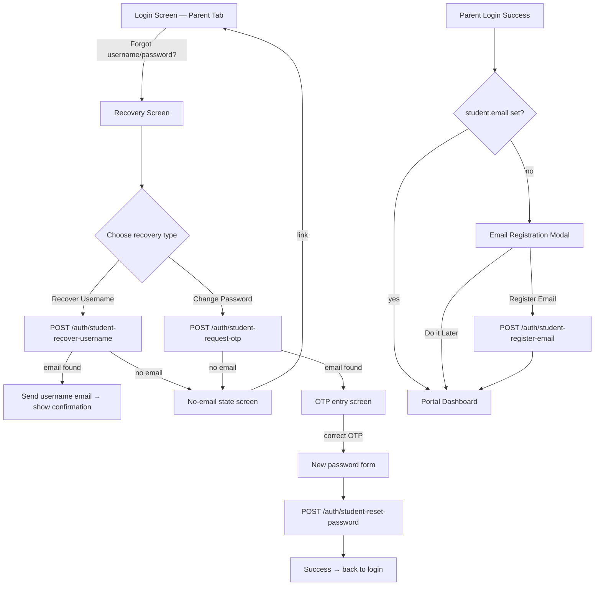

# Design Document

## Feature: Parent Credential Recovery

---

## Overview

This feature adds a self-service credential recovery flow to the parent/student portal. Currently, `puser` and `ppass` are stored on the `Student` MongoDB document and there is no recovery path — parents who forget their credentials must contact the school office.

The solution adds:
1. Three new fields on the `Student` model: `email`, `otp`, `otpExpiry`.
2. Five new unauthenticated API routes in `server/routes/auth.js`.
3. A multi-screen recovery flow embedded inside the existing `Login` component in `App.jsx` (parent tab).
4. A post-login email registration modal in `ParentPortal.jsx`.

Email delivery reuses the existing `sendMail` helper (Resend API) already present in `auth.js`. Password reset writes directly to `ppass` (plain text), consistent with how the rest of the codebase handles parent passwords.

---

## Architecture



---

## Components and Interfaces

### Backend — `server/routes/auth.js`

Five new routes, all unauthenticated (no `auth` middleware) except `student-register-email` which requires a valid parent JWT.

#### `POST /api/auth/student-recover-username`
- Body: `{ identifier }` — admission number or email
- Looks up student by `admno` or `email` (case-insensitive)
- If found and `email` set: sends username email, returns `{ ok: true }`
- If found but no email, or not found: returns `{ ok: true, noEmail: true }` (same response to avoid enumeration — Requirement 8.1)

#### `POST /api/auth/student-request-otp`
- Body: `{ identifier }`
- Looks up student by `admno` or `email`
- If found and `email` set: generates 6-digit OTP, stores `otp` + `otpExpiry` (10 min), sends OTP email, returns `{ ok: true, maskedEmail }`
- If found but no email, or not found: returns `{ ok: true, noEmail: true }`
- Overwrites any existing OTP (Requirement 8.2)

#### `POST /api/auth/student-verify-otp`
- Body: `{ identifier, otp }`
- Validates OTP against stored value and expiry
- Returns `{ ok: true }` on success, error on invalid/expired

#### `POST /api/auth/student-reset-password`
- Body: `{ identifier, otp, newPassword }`
- Re-validates OTP (prevents replay without re-verifying)
- Validates `newPassword.length >= 6`
- Updates `ppass`, clears `otp` and `otpExpiry`
- Returns `{ ok: true }`

#### `POST /api/auth/student-register-email` *(requires auth)*
- Body: `{ email }`
- Requires valid parent JWT (`req.user.studentId`)
- Updates `email` field on the student document
- Returns `{ ok: true }`

### Frontend — `client/src/App.jsx` (Login component)

The `Login` component gains a `recoveryScreen` state that replaces the login form when active. Sub-screens are driven by a `recoveryStep` state:

| `recoveryStep` | Screen shown |
|---|---|
| `null` | Normal login form |
| `choose` | Enter identifier + choose recovery type |
| `username-sent` | Confirmation: username emailed |
| `otp-entry` | Enter OTP |
| `new-password` | Enter new password |
| `success` | Password reset success |
| `no-email` | No registered email message |

New storage functions added to `client/src/storage.js`:
```js
studentRecoverUsername(identifier)
studentRequestOtp(identifier)
studentVerifyOtp(identifier, otp)
studentResetPassword(identifier, otp, newPassword)
studentRegisterEmail(email)   // authenticated
```

### Frontend — `client/src/ParentPortal.jsx`

After a successful parent login, `App.jsx` already passes `student` to `ParentPortal`. The `ParentPortal` component gains an `EmailRegistrationPrompt` modal that checks `student.email` on mount. If absent, the modal is shown. It calls `studentRegisterEmail` on submit.

---

## Data Models

### Student model additions (`server/models/Student.js`)

```js
email:     { type: String, default: '' },
otp:       { type: String, default: '' },
otpExpiry: { type: Date,   default: null },
```

No migration needed — MongoDB/Mongoose treats absent fields as their defaults.

### Student lookup logic

Both recovery routes accept an `identifier` that can be either:
- An admission number (`admno` field)
- An email address (`email` field, case-insensitive)

```js
const student = await Student.findOne({
  $or: [
    { admno: identifier },
    { email: new RegExp('^' + escapeRegex(identifier) + '$', 'i') },
  ]
});
```

When multiple sessions exist for the same student, the most recently created record is used (consistent with `parent-login`).

### OTP lifecycle

```
Request OTP → store { otp, otpExpiry: now+10min }
Verify OTP  → check otp match AND otpExpiry > now
Reset pass  → update ppass, set otp='', otpExpiry=null
```

---

## Correctness Properties

*A property is a characteristic or behavior that should hold true across all valid executions of a system — essentially, a formal statement about what the system should do. Properties serve as the bridge between human-readable specifications and machine-verifiable correctness guarantees.*

### Property 1: OTP expiry invalidation

*For any* student record with a stored OTP, if the current time is past `otpExpiry`, the verify-OTP route SHALL reject the OTP regardless of whether the value matches.

**Validates: Requirements 4.2, 4.7**

### Property 2: OTP overwrite on re-request

*For any* student record that already has a stored OTP, requesting a new OTP SHALL replace the old OTP and reset the expiry, so the old OTP is no longer accepted.

**Validates: Requirements 8.2**

### Property 3: Password reset clears OTP

*For any* successful password reset, the student record's `otp` field SHALL be empty and `otpExpiry` SHALL be null after the operation completes.

**Validates: Requirements 4.5, 8.3**

### Property 4: Minimum password length enforcement

*For any* new password string of fewer than 6 characters, the reset-password route SHALL reject the request and leave `ppass` unchanged.

**Validates: Requirements 4.5, 8.4**

### Property 5: No-email response indistinguishability

*For any* identifier — whether it matches a student with no email, or matches no student at all — the recovery routes SHALL return the same `{ ok: true, noEmail: true }` response shape, revealing no information about whether the identifier matched a record.

**Validates: Requirements 8.1**

### Property 6: Email registration round-trip

*For any* valid email address submitted via the register-email route, a subsequent lookup of that student record SHALL return the same email address in the `email` field.

**Validates: Requirements 6.5, 7.1, 7.2**

---

## Error Handling

| Scenario | Backend response | Frontend display |
|---|---|---|
| Email service (Resend) fails | `500 { error: '...' }` | "Failed to send email. Please try again." with retry button |
| OTP expired | `400 { error: 'OTP has expired' }` | Expiry message + "Request new OTP" button |
| OTP incorrect | `400 { error: 'Invalid OTP' }` | "Incorrect OTP, please try again" |
| Password too short | `400 { error: 'Password must be at least 6 characters' }` | Inline validation message |
| No email registered | `200 { ok: true, noEmail: true }` | No-email state screen (same for matched/unmatched — Req 8.1) |
| Email save fails | `500 { error: '...' }` | Error in modal with retry |
| Network error | fetch throws | "Cannot reach server" message |

All recovery routes are unauthenticated and do not expose stack traces. Error messages are user-friendly strings.

---

## Testing Strategy

### Unit tests (example-based)

- OTP generation produces a 6-digit numeric string
- `otpExpiry` is set to approximately 10 minutes in the future
- Identifier lookup matches by `admno` and by `email` (case-insensitive)
- `student-register-email` rejects requests without a valid JWT
- Password shorter than 6 characters is rejected with the correct error

### Property-based tests

Using a property-based testing library (e.g., **fast-check** for JavaScript):

Each property test runs a minimum of 100 iterations.

- **Property 1** — Generate random OTP strings and timestamps past expiry; assert verify route always rejects.
  Tag: `Feature: parent-credential-recovery, Property 1: OTP expiry invalidation`

- **Property 2** — Generate arbitrary first OTPs; request a second OTP; assert first OTP is rejected.
  Tag: `Feature: parent-credential-recovery, Property 2: OTP overwrite on re-request`

- **Property 3** — Generate arbitrary valid OTP + password combinations; after successful reset, assert `otp === ''` and `otpExpiry === null`.
  Tag: `Feature: parent-credential-recovery, Property 3: Password reset clears OTP`

- **Property 4** — Generate strings of length 0–5; assert all are rejected by reset-password.
  Tag: `Feature: parent-credential-recovery, Property 4: Minimum password length enforcement`

- **Property 5** — Generate arbitrary identifiers (matching and non-matching); assert response shape is identical.
  Tag: `Feature: parent-credential-recovery, Property 5: No-email response indistinguishability`

- **Property 6** — Generate arbitrary valid email strings; register then read back; assert equality.
  Tag: `Feature: parent-credential-recovery, Property 6: Email registration round-trip`

### Integration tests

- Full recovery flow: request OTP → verify OTP → reset password → login with new password succeeds
- Email registration prompt appears when `student.email` is absent, does not appear when present
- Resend API call is made with correct `to`, `subject`, and HTML body fields (mock Resend in tests)
